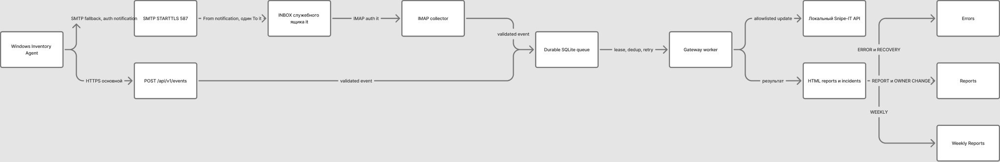

# SnipeIT Inventory Gateway v1.0.0

Это публичная обезличенная редакция моего production-проекта. Я оставил здесь
рабочий код, тесты, схемы, installer/update/rollback и русскую документацию,
но заменил реальные домены, IP, адреса, пользователей, пути и Snipe-IT field
handles на `example.com`, адреса RFC 5737 и нейтральные идентификаторы.
Примерные значения нужно заменить параметрами своей инфраструктуры.

> Статус: активная разработка. Я завершил код и автоматические проверки этой
> итерации, но production-настройки, реальные field handles, TLS/IMAP и canary
> должны быть подтверждены в закрытом окружении перед включением.

Я разработал эту систему, потому что мне была нужна инвентаризация, не
привязанная к доступности локальной сети. Обычный агент, который пишет прямо в
Snipe-IT, перестаёт быть полезным, как только ноутбук уезжает из офиса или
теряет VPN. Хранить Snipe-IT API token и SSH key на каждом Windows-компьютере я
тоже не хотел: компрометация одного endpoint сразу открыла бы доступ к
внутренней системе учёта.

Поэтому я вынес доверенную часть в отдельный Gateway. Windows-агент собирает
инвентаризацию и сначала отправляет зашифрованное событие через
`HTTPS POST /api/v1/events`. Если HTTPS временно недоступен, агент отправляет
то же событие письмом с читаемой темой и зашифрованным вложением. Если нет и
почты, encrypted envelope остаётся в ограниченной локальной очереди и
повторяется позднее. Только Gateway находится рядом со Snipe-IT и использует
его локальный API.

## Что я реализовал

- узкий HTTPS endpoint без публичного доступа к Snipe-IT API;
- резервную доставку SMTP/IMAP без plaintext inventory во вложении;
- единую durable SQLite queue для HTTPS и почтового ingest;
- дедупликацию по `event_id`, поколения, watermark/stale protection, leases,
  retry и dead-letter;
- AES-256-CBC Encrypt-then-MAC с отдельным HMAC-SHA256 key, случайными salt/IV,
  `key_id` и ротацией;
- Windows installer, SYSTEM scheduled task, machine-DPAPI для SMTP credential,
  локальные state/log/queue, rollback и uninstall;
- IMAP-классификатор, который локально декодирует MIME Subject, распознаёт
  только проектные письма и не трогает unrelated mail;
- server-side ownership policy: endpoint не может назначить служебную учётную
  запись владельцем или сам объявить пользователя уволенным;
- подтверждение нового владельца тремя разными событиями минимум за 24 часа,
  защита от назначения «на никого» и ежедневного перескакивания между людьми;
- русские брендированные HTML-отчёты EXAMPLE INVENTORY, пять KPI сверху, понятные
  статусы и всего три IMAP-папки: `Reports`, `Weekly Reports`, `Errors`;
- строгий почтовый контракт: отдельные IMAP/SMTP identities и passwords,
  единственный получатель, запрет `Cc`, согласованные темы и служебные headers;
- отдельная дедупликация писем по содержимому и периоду отчёта;
- systemd hardening, Nginx limits, logrotate, backup/restore, update/rollback,
  healthcheck и миграцию с 1.3.3.

## Почему я выбрал Gateway

Я хотел оставить агент простым и однонаправленным: ему нужны только исходящие
соединения TCP `2443` и, для fallback, TCP `587`. Входящие порты на Windows ПК
не требуются. Snipe-IT token остаётся в закрытом server config, а запись в
Snipe-IT выполняет один контролируемый worker. Это дало мне единое место для
валидации схемы, защиты от старых событий, повторов, уведомлений и аудита.

## Безопасность

Я использую случайный 256-bit master key, а не человеческий пароль. Через HKDF
я вывожу независимые encryption и MAC keys. HMAC проверяется до расшифрования;
Base64 служит только транспортной кодировкой. В HTTPS ingest я ограничил
маршрут, размер тела, частоту и число соединений. В почтовом ingest я проверяю
отправителя, тему, служебный заголовок, тип и количество вложений, размер,
схему, `key_id`, HMAC и `event_id`.

Production secrets я не храню в Git, примерах, тестах, release artifacts или
логах. Перед каждым push я запускаю secret scan staged content, проверяю
историю и отдельно просматриваю diff. Для публичной редакции я дополнительно
проверяю, что в неё не попали внутренние домены, адреса, учётки и секреты.

## Нестандартные учётные записи

Стандартный логин — `i.ivanov`: одна буква, точка, фамилия. Исторические
логины, которые не подходят под этот формат, проходят только через явный список
`ownership.non_standard_accounts`. В закрытой конфигурации Gateway и агента
сейчас указаны `LegacyUserA` и `LegacyUserB`; любое другое нестандартное имя
остаётся без назначения владельца.

## Документация и эксплуатация

Я описал компоненты и порядок работы в следующих документах:

- [архитектура](docs/ARCHITECTURE-RU.md);
- [путь события от Windows-агента](docs/AGENT-FLOW-RU.md);
- [защита от случайной смены пользователя](docs/OWNERSHIP-SAFETY-RU.md);
- [почтовые папки, отчёты и защита от дублей](docs/MAIL-REPORTS-RU.md);
- [операционный runbook](docs/OPERATIONS-RU.md);
- [миграция с 1.3.3](docs/MIGRATION-1.3.3-RU.md);
- [готовность к пилоту и production gates](docs/READINESS-RU.md);
- [план релиза v1.0.0](docs/RELEASE-RU.md).

## Схемы доставки и почтовой сортировки

Я отрисовал обе рабочие схемы в Figma/FigJam и сохранил их рядом с кодом, чтобы
архитектура была понятна и без доступа к Figma:

- доставка события: [PNG](docs/mail-delivery-figma.png),
  [SVG](docs/mail-delivery-figma.svg),
  [редактируемая схема в Figma](https://www.figma.com/board/lC8wdiuqwkBqjs2yGzhR2x);
- строгая сортировка IMAP: [PNG](docs/mail-routing-figma.png),
  [SVG](docs/mail-routing-figma.svg),
  [редактируемая схема в Figma](https://www.figma.com/board/JaReVpItT0dzQO2UB71BV5).

В публичной редакции отчёты используют нейтральную текстовую шапку. Закрытый
production-логотип и реальные скриншоты сюда намеренно не входят.

## Что осталось до production

Код и автоматические проверки готовы к server staging. Перед включением я
сверю реальные Snipe-IT field handles/IDs, проверю IMAP/SMTP, TLS-сертификат,
split DNS, NAT и rollback drill. Production cutover выполню после этого
staging и отдельного подтверждения.

---

© lststrdst
