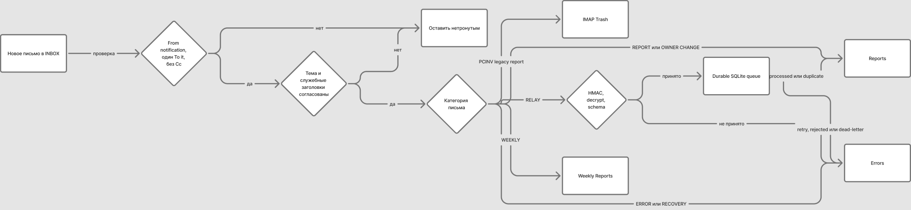

# Почтовые папки и отчёты

Я переписал почтовую часть так, чтобы ящик был рабочим интерфейсом, а не
складом технических JSON/TXT-вложений. У всех новых писем одно имя продукта,
короткая машинно-читаемая метка и ясная русская часть темы.

## Структура папок IMAP

```text
SnipeIT Inventory/
  Reports
  Weekly Reports
  Errors
```

Я намеренно оставил только три папки. Durable SQLite queue отвечает за retry и
dead-letter, поэтому изображать очередь папками `Offline Relay`, `Processed`
и `Rejected` больше не нужно.



Схему можно открыть как [SVG](mail-routing-figma.svg) или редактировать
[в Figma/FigJam](https://www.figma.com/board/JaReVpItT0dzQO2UB71BV5).

## Контракт тем и маршрутов

| Метка | Пример темы | Папка |
|---|---|---|
| `REPORT` | `[SnipeIT Inventory Gateway][REPORT] LAPTOP-107 · инвентаризация обновлена` | `Reports` |
| `OWNER CHANGE` | `[SnipeIT Inventory Gateway][OWNER CHANGE] LAPTOP-107 · user.old → user.new` | `Reports` |
| `WEEKLY` | `[SnipeIT Inventory Gateway][WEEKLY] 2026-W36 · критично 2 из 148` | `Weekly Reports` |
| `RELAY` | `[SnipeIT Inventory Gateway][RELAY] LAPTOP-107 - event 42feb0c84dd87022` | `Reports` после успешной обработки, иначе `Errors` |
| `ERROR` | `[SnipeIT Inventory Gateway][ERROR] IMAP · требуется внимание` | `Errors` |
| `RECOVERY` | `[SnipeIT Inventory Gateway][RECOVERY] IMAP · работа восстановлена` | `Errors` рядом с исходным инцидентом |

`RECOVERY` означает восстановление работы после зарегистрированной ошибки:
например, IMAP снова доступен или обработчик очереди возобновил работу.
Я отправляю это уведомление один раз после инцидента и сохраняю рядом с
ошибкой, чтобы было видно, что сбой завершился.

Тема нужна человеку для быстрого просмотра, но не является единственным
критерием. Категория подтверждается `X-SnipeIT-Category`; класс письма —
`X-SnipeIT-Mail-Class`; fallback дополнительно требует `X-SnipeIT-Relay: 1`
и ровно одно зашифрованное `.snipeit-event.json`. Несовпадение темы, категории,
отправителя или получателя оставляет письмо нетронутым.

## Почему письмо не попадёт в личный ящик

Одинаковый пароль сам по себе не направляет письмо в конкретный ящик. Ошибка
старой итерации возникала из-за смешения почтовых ролей. Теперь конфигурация
запускается только при одновременном выполнении правил:

- IMAP входит только в `inventory@example.com`;
- SMTP авторизуется только как `notification@example.com`;
- заголовок `From` равен SMTP account, единственный `To` — `inventory@example.com`;
- `Cc` и личные адреса запрещены для проектного маршрута;
- IMAP и SMTP service accounts обязаны иметь разные пароли;
- агент проверяет, что DPAPI credential принадлежит ровно `MailFrom`.

Пароли нигде не печатаются и не сравниваются с человеческими значениями. При
ошибке конфигурация отклоняется до подключения к почтовому серверу.

## Что происходит после relay

- `processed` или `stale`: исходное `[RELAY]` перемещается в `Reports`, а
  обычный HTML-отчёт имеет метку `[REPORT]`;
- временная ошибка: событие остаётся в SQLite retry queue, письмо переносится
  в `Errors`, а throttled incident содержит компонент и безопасный текст ошибки;
- окончательная ошибка или dead-letter: письмо и отдельный `[ERROR]` остаются
  в `Errors` для ручного разбора;
- посторонняя почта остаётся во `Входящих` без флагов, копирования и удаления.

Старые отчётные папки и темы `PCINV-*`/`PC Inventory *` считаются legacy и
переносятся в IMAP Trash. Старый `Offline Relay` исключён из очистки: сначала
его зашифрованные события безопасно обрабатываются, затем результат попадает
в `Reports` или `Errors`.

## Защита от дублей

Транспортные события уже дедуплицируются по криптографическому `event_id`.
Для писем я добавил отдельную таблицу `report_delivery`:

- отчёт по компьютеру отправляется только при изменении стабильного отпечатка
  inventory/владельца;
- повторная доставка и новое время `observed_at` сами по себе письмо не
  создают;
- письмо о смене пользователя привязано к одному фактическому transition;
- еженедельный отчёт отправляется один раз на ISO-неделю;
- ошибочная SMTP-отправка снимает reservation и может быть безопасно повторена.

## Еженедельный отчёт

Верхняя часть показывает пять KPI: всего, актуальные, требуют внимания,
критические и никогда не передававшие данные. Ниже находится блок действий и
таблица с пользователем, агентом, последней инвентаризацией, давностью,
последней ошибкой и цветным статусом.

- актуально: менее 7 дней;
- требует внимания: 7–13 дней;
- критично: 14 дней и больше;
- нет данных: поле успешной инвентаризации ещё ни разу не заполнено.

Пороговые значения, категории активов, timezone и максимальное число строк
настраиваются в закрытом config. Публичная редакция использует нейтральную
текстовую шапку; собственный логотип можно добавить как встроенный CID-ресурс,
не загружая его со стороннего сервера и не создавая tracking pixel.
