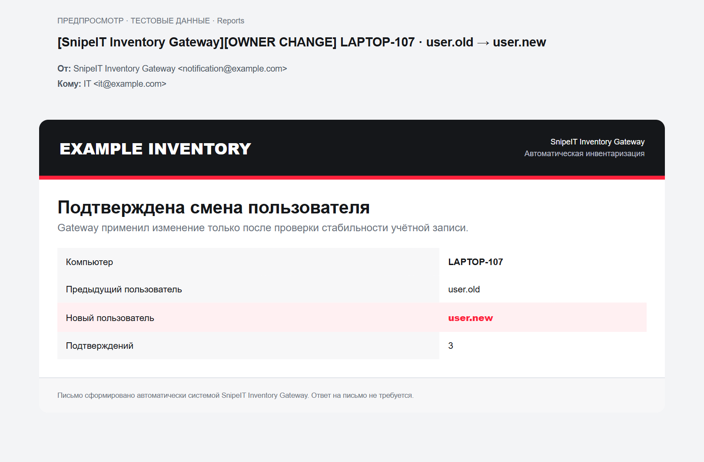
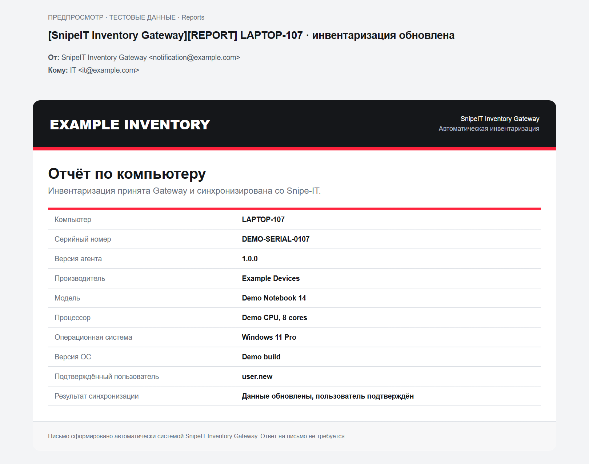

# Примеры писем

Я сохранил здесь примеры из текущих HTML-шаблонов, чтобы вид писем можно было
проверить прямо в GitHub. Компьютер, серийный номер, пользователи, оборудование
и адреса в примерах вымышленные. Никакие письма при генерации не отправляются,
закрытая конфигурация не читается.

## Смена владельца — OWNER CHANGE

Я показываю предыдущего и нового пользователя, компьютер и количество
подтверждений. Такая тема означает уже подтверждённую смену, а не первое
появление другого пользователя. Письмо попадает в `Reports`.



[HTML-пример](owner-change.html) можно скачать и открыть локально в браузере.

## Инвентаризация — REPORT

Я показываю основные данные компьютера и результат синхронизации со Snipe-IT.
Это обычный отчёт в папке `Reports`, а не транспортное письмо `RELAY`.



[HTML-пример](computer-report.html) можно скачать и открыть локально в браузере.

## Как я обновляю примеры

После установки зависимостей проекта я выполняю из корня репозитория:

```shell
python scripts/render_mail_examples.py
```

Скрипт берёт шаблоны из текущего checkout и обновляет оба HTML-файла.
PNG — проверенные браузерные снимки этих HTML-файлов; после изменения шаблона
я пересоздаю их и повторно проверяю перед публикацией.

Верхний блок с темой, отправителем и получателем я добавил только для
предпросмотра. В реальном письме эти поля показывает почтовый клиент.
Я использую текстовую шапку без CID-логотипа, чтобы пример открывался автономно.
Шрифты, отступы и скругления в разных почтовых клиентах могут отличаться.
